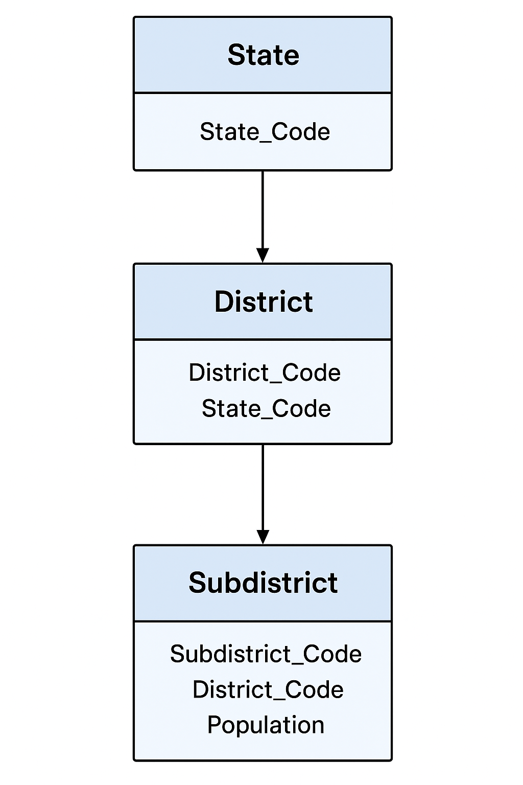

# 🧮 Census Population Data Management System (MySQL Project)

This project is a **Census Population Data Management System** built using **MySQL**.  
It demonstrates how to clean, normalize, and analyze large-scale census data for **states, districts, and sub-districts** in India.

The goal is to transform raw census data into a structured relational database and generate meaningful demographic insights using **SQL queries**.

---

## 📂 Dataset

The raw data used in this project is available in the [`data/`](./data) folder as:

- **population_raw.csv** – contains the census data for states, districts, and subdistricts.

You can import it into MySQL using:

```sql
LOAD DATA INFILE '/path/to/population_raw.csv'
INTO TABLE population.data
FIELDS TERMINATED BY ','
IGNORE 1 ROWS;
```

---

## 📁 Project Structure

```
census-population-data-mgmt-system/
│
├── 1_database_setup/
│   ├── 1_create_database.sql
│   ├── 2_create_tables.sql
│   ├── 3_insert_data.sql
│
├── 2_data_cleaning/
│   ├── 1_data_checks.sql
│   ├── 2_cleaning_queries.sql
│
├── 3_analysis_queries/
│   ├── 1_level1_groupby_having.sql
│   ├── 2_level2_aggregations.sql
│   ├── 3_level3_subqueries_joins.sql
│
├── 4_reports/
│   ├── 1_top_districts_by_population.sql
│   ├── 2_state_population_share.sql
│   ├── 3_summary_population_density.sql
│
├── 5_docs/
│   ├── ERD.png
│   ├── project_overview.md
│   ├── dataset_description.md
│
└── README.md
```

---

## 🏗️ Project Overview

This project follows the full **data engineering pipeline**:

1. **Database Setup:** Creating the population database and raw data tables.  
2. **Data Cleaning:** Handling missing values, fixing data types, and computing derived columns.  
3. **Data Normalization:** Designing and populating normalized tables for state, district, and subdistrict.  
4. **Data Analysis:** Using `GROUP BY`, `HAVING`, and subqueries to extract key population insights.  
5. **Reporting:** Generating reports such as top/bottom states, density summaries, and population distribution.

---

## 📊 Key Analytical Questions Solved

- Number of subdistricts per district  
- Districts with more than 10 subdistricts  
- Total population per state and district  
- Average population density by district  
- States with population > 10 million  
- States containing districts with >1M people  
- Top and bottom states/districts by population  
- Percentage contribution of each district to its state’s total population  

---

## 🧱 Database Design



### Entities:
- **State:** Stores unique state codes and names  
- **District:** Linked to states via `State_Code`  
- **Subdistrict:** Linked to districts via `District_Code`, with additional metrics like `Area`, `Density`, and `Population`

---

## ⚙️ Tech Stack

- **Database:** MySQL  
- **Language:** SQL (DDL, DML, Aggregations, Subqueries, Joins)  
- **Tools:** MySQL Workbench / VS Code  
- **Version Control:** Git & GitHub  

---

## 🚀 How to Run This Project

1. **Clone the repository**
   ```bash
   git clone https://github.com/<your-username>/census-population-data-mgmt-system.git
   cd census-population-data-mgmt-system
   ```

2. **Open MySQL Workbench or any SQL IDE**

3. **Run scripts in order**
   ```
   1_database_setup/
   2_data_cleaning/
   3_analysis_queries/
   4_reports/
   ```

4. **Review insights** from the analysis queries and reports.

---

## 👩‍💻 Author

**Manasa**  
_Data Engineering Learner | SQL Enthusiast_  

🌐 [LinkedIn](https://www.linkedin.com/in/manasa-thati-121a5b21a/)

---
